# Scenes of FFXIV #
Scenes of FFXIV is a gallery site intended to showcase a number of locations from the critically acclaimed MMORPG Final Fantasy XIV (FFXIV).
It will contain a number of in-game screenshots from these locations as well as some descriptive text detailing the history or some key features of the landscape shown.
 
This site is intended for any who may be interested in FFXIV, whether it is existing players, those who cannot play, who used to and wish for a feeling of nostalgia, or those who are on the fence and may want a closer look at some of the vistas that are on offer.

## Features ##
The Navigation bar contains the page header as a central element, "Scenes of FFXIV". It also acts as a link to the Homepage. On larger screens the navigation menu is below the title in a row, with an underline denoting which page the user is currently visiting.  

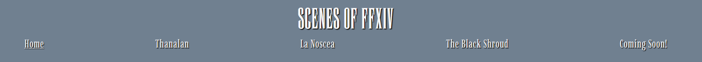
 
For mobile devices and small screens the navigation bar is a hidden element until the burger icon is selected. The nav menu then opens below the icon and works as similarly to the larger screen version. The nav menu can then be closed by selecting the icon again.
 
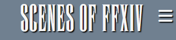
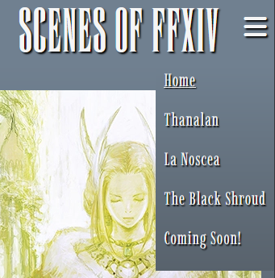
 

The footer contains six links; four to social pages, and two to store pages for the game.
They are split into distinct groups, with the socials leading to Facebook, Instagram, Discord, and Reddit. The store pages lead to the Steam Store and the FFXIV homepage respectively.
 
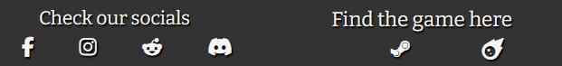
 
As this is a gallery page, and the goal is to allow the User to see the screenshots, the header and footer are glued to the top and bottom of the page respectively.
 

The Hero image on the Homepage is responsive and changes size, starting from the middle of the image, on larger screens by design.  

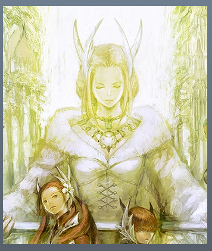
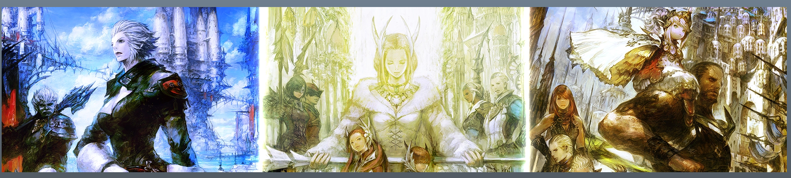
 

For the main content of the Homepage, there is an introduction on the site, the game it is based on, and instructions on using the site. There are also additional links to the various pages available with the crests of those area's ruling parties/armies. On Mobile, these are in one line, but on larger screens this is spread into two columns to save space and be more visually appealing.
 

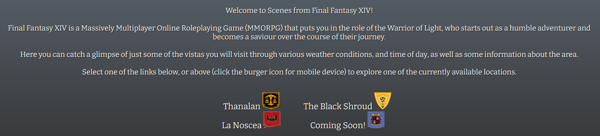

 

The content pages contain a sub-heading, and introduction to the area, and then the main focus: A description of a region, and two images from said region, repeated three times.
 

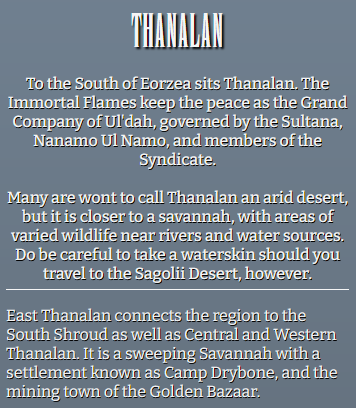
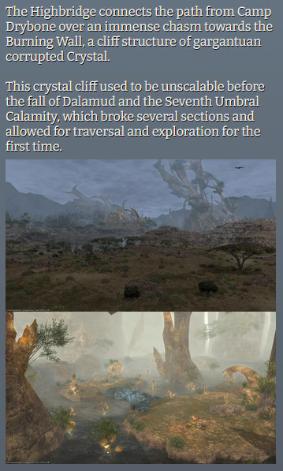
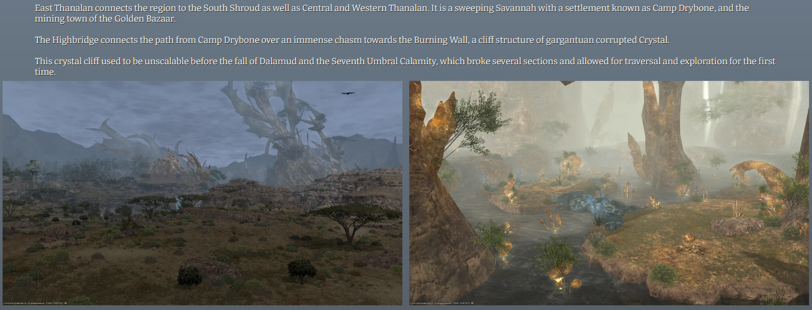

 

There is a Coming Soon page with a small section of text explaining that more content is on the way, and a Lalafell Alchemist performing experiments, for visual flair.

Similarly, the 404 page, which redirects at broken or missing URLs, does something similar, with a Lalafell performing the "This is fine" meme. Both pages have a small paragraph with a URL to the homepage, though all other nav bar and footer URLs are present and in operation.

 

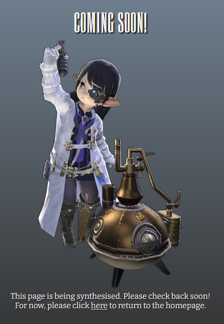
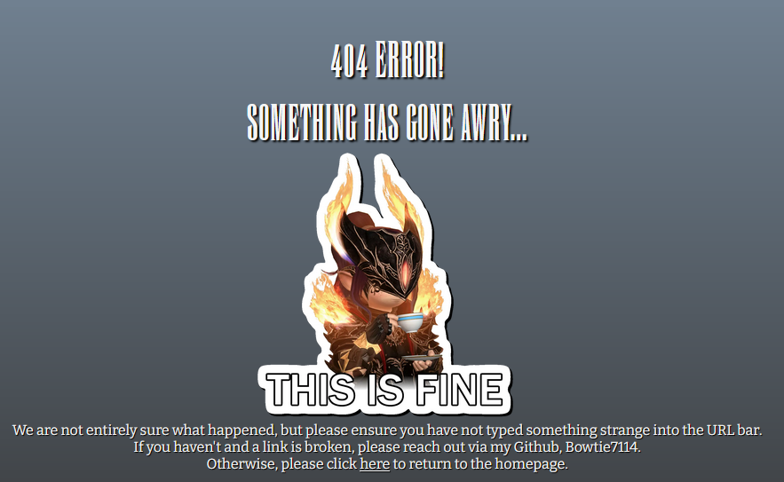

 

The favicon is set to the icon for the Sightseeing Log in game, which I thought was appropriate, and the title changes depending on the page the user is on, preceeded by "FFXIV Scenes - ".

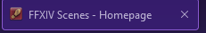

## Design ##
### Wireframe ###
Home page
  
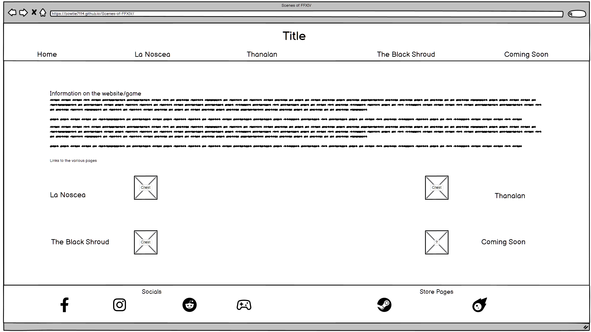
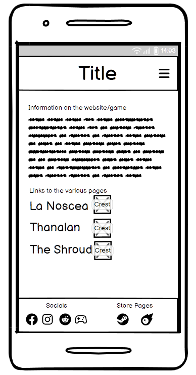
 
Mobile Home page with Burger Icon selected
 
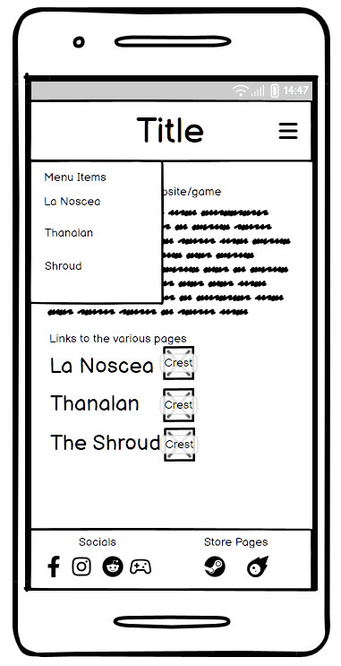
  

Content pages
  
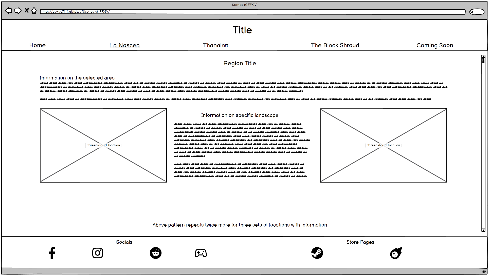
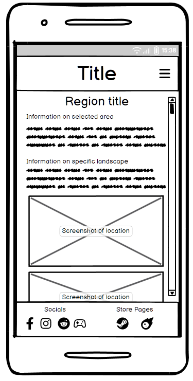
 
Two images per block of information. On mobile, text is followed by both images.
  

Coming Soon page
  
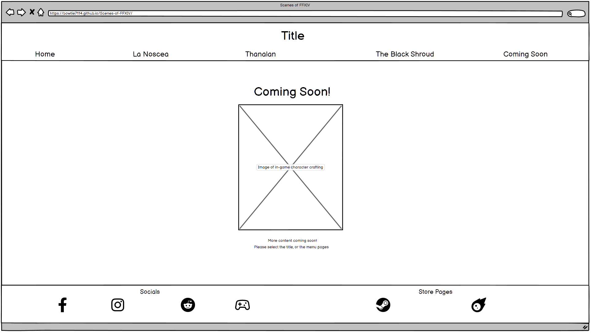
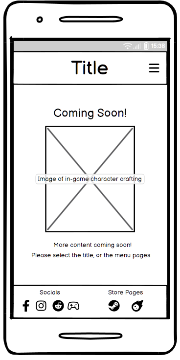

## Technologies ##
- HTML
    Used as the main language for the site.
- CSS
    Used to style the website via an external stylesheet.
- GitHub
    Used as a repository to store site information and act as a hosting platform.
- Git
    Used to commit and push information to GitHub.
- FontAwesome
    Used to display symbols such as the burger icon, socials, and store pages icons.
- balsamiq
    Used to create wireframe designs for website.
- cloudconvert.com
    Used to convert hero and content images from .png to .webp.

## Testing ##

### Bugs ###
When styling the Store Page icons from Font Awesome (Steam and Meteor), using the 'i' attribute did not allow the colour to change as it did with the Socials icons. I had to use the 'a' attribute. This will not be looked into as it works as is.
 
When creating wireframes, copying the mobile homepage facebook image changed it to a different facebook image on paste. Did not change as it does not affect functionality.
 
When attempting to add a second font to the site via import from Google Fonts, the formatting broke, causing either the original font I had download and added via @font-face to break and revert to serif, or for the header style to break. This was corrected by instead downloading the font pack, uploading to the repo and applying via @font-face.
 
I was unable to utilise the official Instagram page for FFXIV without being signed into Instagram. Testing this with my girlfriend's Instagram account allowed the link to work without issue (https://www.instagram.com/ffxiv?igsh=dmJrcmNoNDM4cmJ0) as such, the Instagram homepage will be used to avoid a 404 error for those that do not have Instagram accounts.
 
Upon testing with other people (Discord server full of friends) the Chrome users identified an issue with the images not showing next to each other as intended, and as Firefox did. Upon some testing, a float declaration was needed for the images on Chrome and Edge to stop them from wrapping around each other. Image was rectified and re-tested with those same users and the images were showing as intended.

### Feedback ###
When testing mobile, feedback received was that the nav menu opened on the left where the burger icon was on the right. As such, this was changed for a better UX. Upon re-testing, several user reported this feature was much improved.
 

## Credits ##
### Content ###
- Font family downloaded from [FontMeme](https://fontmeme.com/fonts/enge-etienne-font/), created by OPTIFONT.
- Font families Imbue and Bitter downloaded from [Google Fonts](https://fonts.google.com/).
- [W3Schools](https://www.w3schools.com) for information on various HTML and CSS tips.
- [Stack Overflow](https://stackoverflow.com/) for information on various HTML and CSS tips.
- [Final Fantasy XIV Fan Kit site](https://na.finalfantasyxiv.com/lodestone/special/fankit/icon/) for various icons used as favicons and README title accompaniment.
- [Final Fantasy XIV Materials Usage License](https://support.na.square-enix.com/rule.php?id=5382&tag=authc) confirming the feasibility of the project and what concessions are required.
- Information regarding locations was taken either from in-game or from the [Final Fantasy Wiki](https://finalfantasy.fandom.com/wiki/Final_Fantasy_Wiki).

### Media ###
- Content images were taken by myself using my own FFXIV account and the in-game screenshot function. Due to weather conditions and a day night cycle, this proved somewhat taxing.
- The Coming Soon image is the public base game render of a Lalafellan Alchemist. The image itself was taken from the [Final Fantasy Wiki](https://finalfantasy.fandom.com/wiki/Alchemist_(Final_Fantasy_XIV)).
- Hero image taken from the [Final Fantasy XIV Fan Kit](https://na.finalfantasyxiv.com/lodestone/special/fankit/desktop_wallpaper/2_0/#nav_fankit).
- 404 image of my character was taken and edited by Royal Jelly, a friend in Final Fantasy XIV who made this into a Discord sticker. 
  
FINAL FANTASY is a registered trademark of Square Enix Holdings Co., Ltd.
© SQUARE ENIX CO., LTD. All rights reserved. 